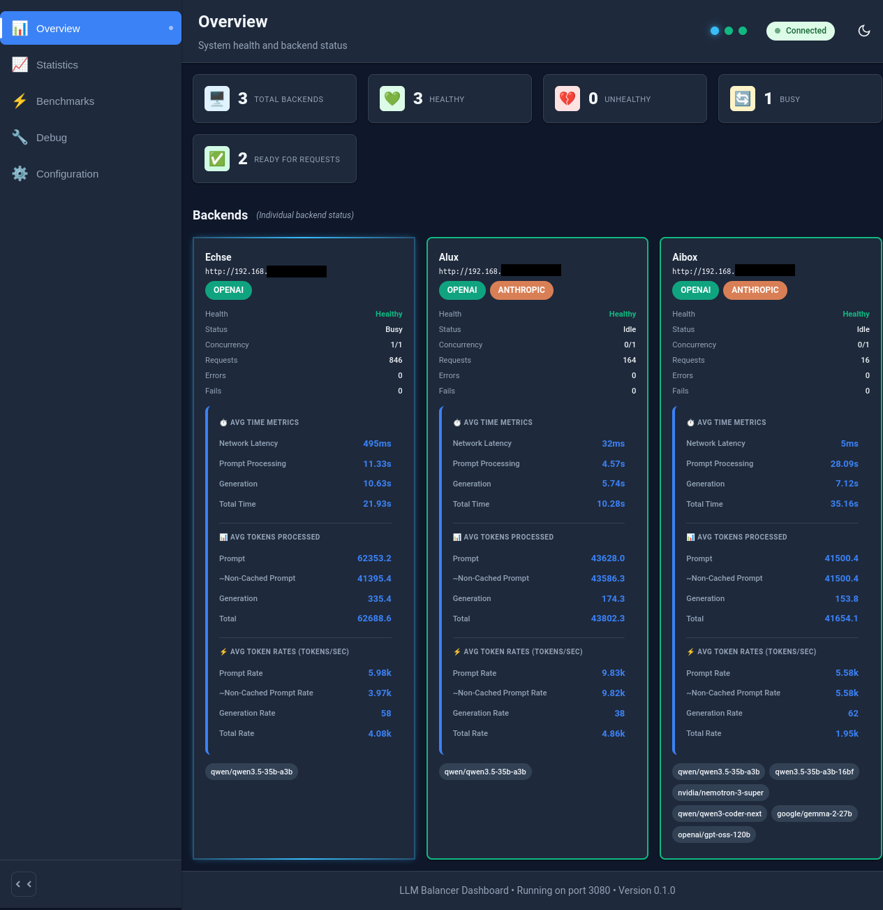
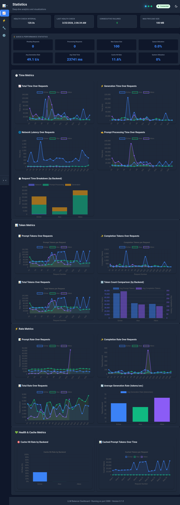
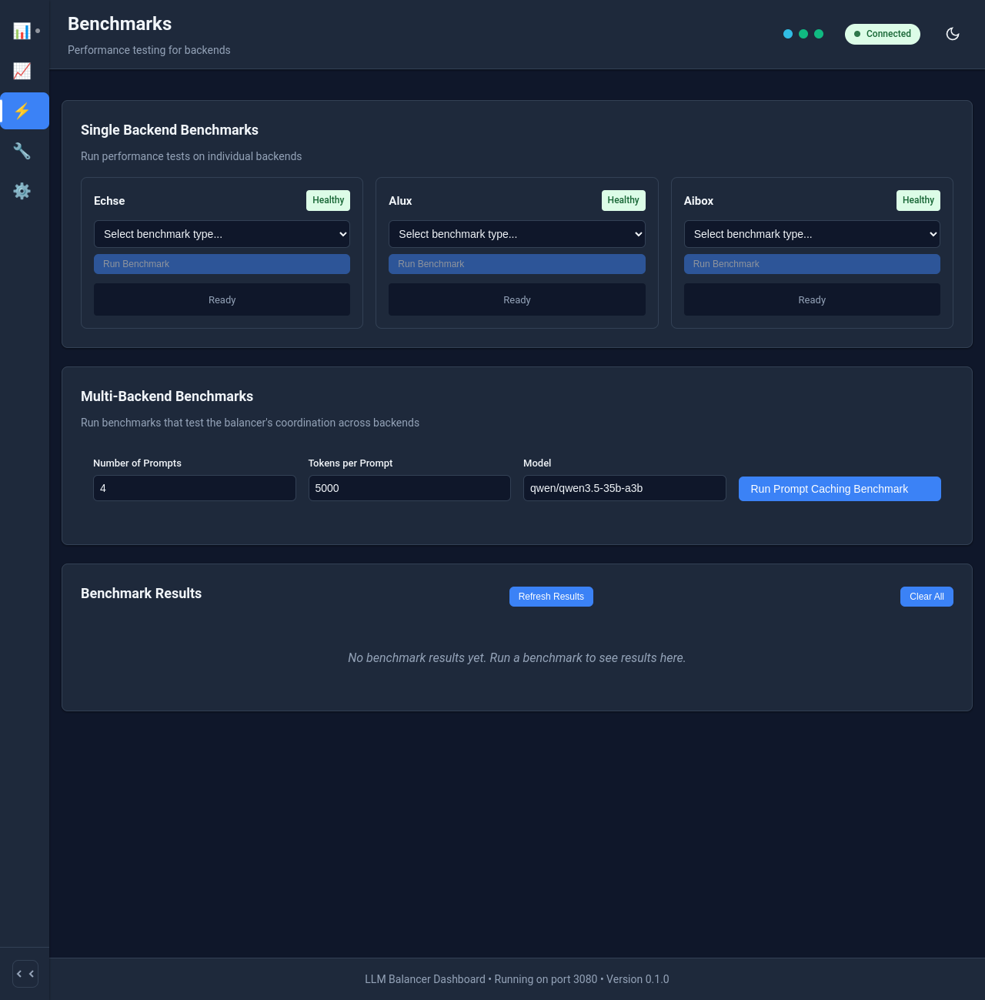
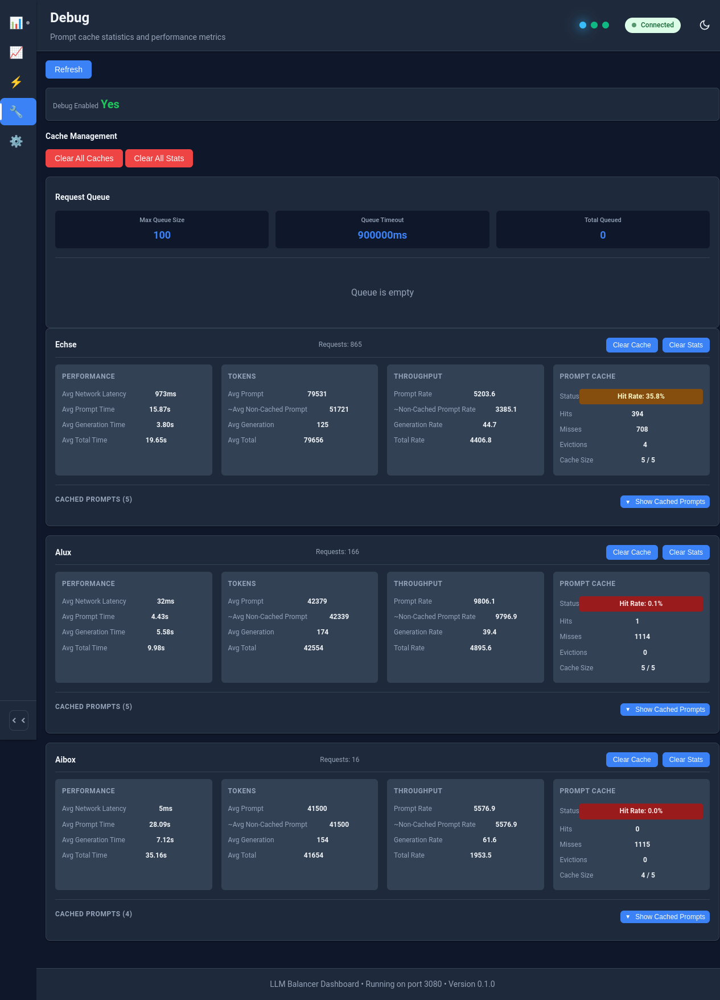
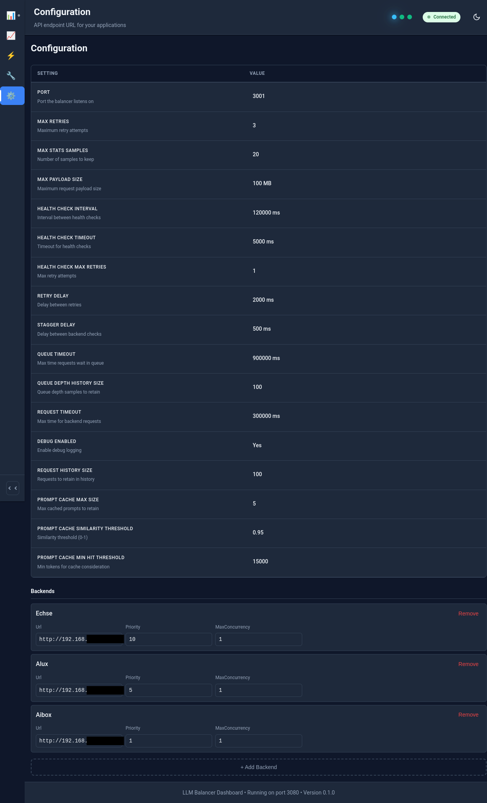

# LLM Balancer

A load balancer for LLM servers with health checking and automatic failover. Supports OpenAI, Anthropic, Google Gemini, and Ollama APIs.

## About This Project

Schäfer List Systems GmbH built and uses this balancer internally to improve computation speed for agentic clients with fixed endpoints and to enhance hardware utilization for our in-house LLM backends.

This project is actively used in production and has proven effective for our needs. We share it with the community as a way to give back something in return.

**Provider:** [Schäfer List Systems GmbH](https://www.schaeferlist.com/de/blog/balancer_overview)

---

## Screenshots

### Overview Dashboard

Main dashboard showing real-time backend health, request statistics, and system status.

> **Visual Indicators**: Blue flashing frames = active streaming | Green flashing = active non-streaming | Solid green = inactive but available | Red = unhealthy



### Statistics

Performance metrics including time tracking, token usage, rate analysis, and cache statistics.



### Benchmarks

Performance testing interface for single backend and multi-backend benchmark tests (under construction).



### Debug

Debug panel with detailed request/response tracking, prompt caching analysis, and performance metrics. CAUTION! Contains sensitive information in debug mode.



### Configuration

Configuration page displaying system settings and backend parameters.



---

## Features

- **Multi-API Support**: Auto-detects OpenAI, Anthropic, Google Gemini, and Ollama APIs
- **Priority-Based Selection**: Configurable priority levels for backend servers
- **Flexible Model Matching**: Regex patterns for matching models across backends with different naming conventions
- **Concurrency Limiting**: Configurable max parallel requests per backend
- **Health Monitoring**: Automatic failure detection and recovery
- **Request Queuing**: FIFO queueing when backends are at capacity
- **Real-Time Monitoring**: Dashboard for tracking backend status and statistics
- **Prompt Caching**: Fingerprint-based KV cache reuse with similarity matching

---

## Documentation

The documentation is structured hierarchically. use the following references to find relevant information to you.

### User
**For installing, configuring, and using the LLM Balancer.**

- **[Installation Guide](docs/user/INSTALLATION.md)** - Docker, manual, and development installation
- **[Usage Guide](docs/user/USAGE.md)** - Configuration and usage examples
- **[Troubleshooting](docs/user/TROUBLESHOOTING.md)** - Common issues and solutions
- **[FAQ](docs/user/FAQ.md)** - Frequently asked questions

### API User
**For developers integrating with the LLM Balancer API.**

- **[API Endpoints Reference](docs/api/ENDPOINTS.md)** - All endpoints with examples
- **[Request/Response Formats](docs/api/REQUEST_RESPONSE.md)** - Data structures and formats
- **[Integration Guide](docs/api/INTEGRATION.md)** - SDK usage and integration examples

### Developer
**For contributors working on the project.**

- **[System Architecture](docs/developer/ARCHITECTURE.md)** - Architecture and design
- **[Data Flow](docs/developer/DATA_FLOW.md)** - Request processing diagrams
- **[Class Reference](docs/developer/CLASSES.md)** - Class hierarchy and interfaces
- **[Testing Guide](docs/developer/TESTING.md)** - Writing and running tests
- **[Contributing Guide](docs/developer/CONTRIBUTING.md)** - Contribution guidelines
- **[Debugging Guide](docs/developer/DEBUGGING.md)** - Debug features
- **[Documentation Guide](docs/developer/DOCUMENTATION_GUIDE.md)** - Documentation standards for contributors

---

## Quick Start

### Quick Configuration

Create a `config.json` file in the project root for Docker:

```bash
cp llm-balancer/config.example.json llm-balancer/config.json
```

Edit `llm-balancer/config.json` to add your backends:

```json
{
  "port": 3001,
  "backends": [
    {
      "url": "http://localhost:11434",
      "name": "Local Ollama",
      "priority": 10,
      "maxConcurrency": 1
    }
  ]
}
```

**The config file is automatically mounted as a volume.**

**For complete configuration options, see [Configuration Guide](docs/components/balancer/CONFIGURATION.md).**

### Docker Installation (Recommended)

Start the LLM Balancer with Docker Compose:

```bash
# Build and start all containers
docker compose up -d --build
```

The load balancer will be available at `http://localhost:3001` and the dashboard at `http://localhost:3080`, unless you configured it differently.

### Manual Installation

See [Installation Guide](docs/user/INSTALLATION.md) for manual installation with npm.

---

## Additional Resources

- **[System Overview](docs/OVERVIEW.md)** - High-level system architecture
- **[Performance Metrics](docs/developer/METRICS.md)** - Token counting and performance tracking
- **[Third-Party Licenses](docs/THIRD-PARTY-LICENSES.md)** - Complete license information for all dependencies

---

## Known Issues

The following issues are currently being worked on:

- **Benchmarks**: Benchmark functionality is not working properly and requires fixes
- **Frontend Configuration**: Configuration management in the frontend interface has issues that need to be resolved

---

## License

This project is licensed under the [MIT License](./LICENSE).

**Third-Party Licenses**: This project includes numerous third-party dependencies. For a complete list, see **[Third-Party Licenses](docs/THIRD-PARTY-LICENSES.md)** (520+ dependencies, all using permissive licenses compatible with MIT).
