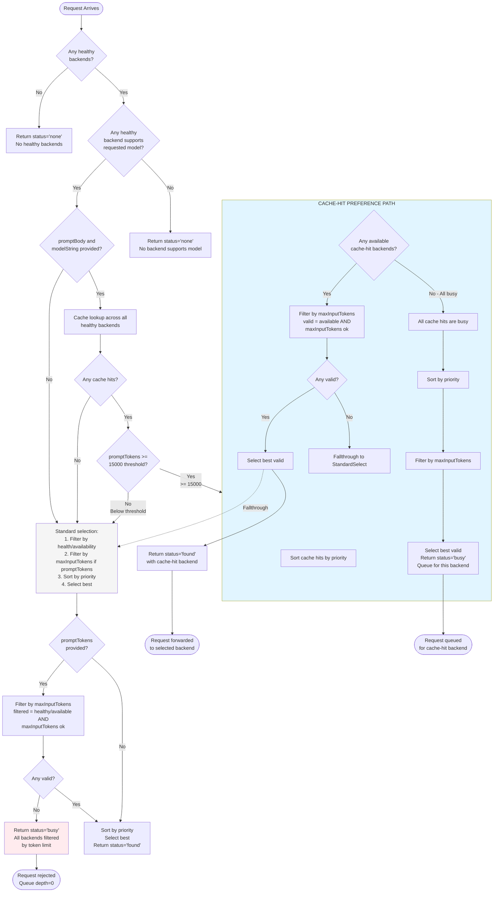

# Backend Selection Decision Tree

This document maps the actual decision tree of `selectBackendWithCache()`.

## Flowchart



## Key Decision Points

### 1. Cache Hit Detection (Lines 310-326)
- Loops through **all healthy backends** (even busy ones)
- Looks for cache match with similarity >= 0.8
- Stores: `{ backend, similarity, matchType }`

### 2. Token Threshold Check (Lines 336-353)
- Counts tokens in promptBody using default tokenizer
- Compares against minHitThreshold (15000 by default)
- If below threshold: **ignores cache hits entirely** and goes to StandardSelect

### 3. Cache-Hit Path (Lines 343-431)
- Only entered if: cache hits exist AND promptTokens >= 15000

#### Available Cache Hits (Lines 348-384)
```javascript
availableCacheHits = allCacheHits.filter(
  m => activeRequestCount < maxConcurrency
)

// Filter by maxInputTokens (CRITICAL)
validCacheHits = availableCacheHits.filter(
  m => m.backend.maxInputTokens === undefined ||
       m.backend.maxInputTokens === null ||
       m.backend.maxInputTokens === 0 ||
       promptTokens <= m.backend.maxInputTokens
)
```

If validCacheHits exists: SELECT and return `status='found'`
If NO validCacheHits: Fall through to StandardSelect

#### Busy Cache Hits (Lines 385-431)
```javascript
// All cache hits are busy
// Filter by maxInputTokens
validBusyBackends = allCacheMatches.filter(...)

if (validBusyBackends.length > 0) {
  SELECT and return `status='busy'`
  // Balancer queues for THIS specific backend
}
```

### 4. Standard Path (Lines 434-457)
```javascript
availableBackends = _filterByHealthAndAvailability(backends)

// Filter by maxInputTokens
if (promptTokens !== undefined) {
  filteredBackends = _filterByMaxInputTokens(availableBackends, promptTokens)
  if (filteredBackends.length === 0) {
    return `status='busy'`, message: 'All backends filtered by token limit'
  }
}

Select by priority and return `status='found'`
```

## The Bug Scenario

Based on your logs, here's what likely happened for req-0137 (4.2MB to AIbox):

1. **Cache lookup succeeded** - AIbox had cache hit with similarity 1.0
2. **Token threshold check passed** - 4.2MB > 15000 tokens
3. **Cache-hit path entered** (lines 343-431)
4. **AIbox was available** (activeRequestCount < maxConcurrency)
5. **AIbox has maxInputTokens=20000**
6. **Token count was calculated** - but possibly the COUNT WASN'T correct or wasn't passed properly

**Critical question**: Was `promptTokens` actually `undefined` when it reached the cache-hit path?

## Where promptTokens Might Be Lost

### In Balancer.js (Line 413-418)
```javascript
const result = this.selector.selectBackendWithCache(
  this.backendPool.getAll(),
  request.criterion,
  promptBody,
  promptTokens  // ← This is passed
);
```

### In selectBackendWithCache (Line 257)
```javascript
selectBackendWithCache(backends, criterion, promptBody, promptTokens = undefined)
```

### But at Line 331-332:
```javascript
const { countTokens } = require('./utils/token-utils');
const promptTokens = countTokens(promptBody);  // ← REASSIGNED locally!
```

**BUG**: Line 332 **reassigns** `promptTokens` using a simpler count (without modelString!)

This means:
- The `promptTokens` parameter might be undefined or incorrect
- The local `promptTokens` is calculated differently (no model-specific tokenizer)

## What We Need to Verify

1. Is the parameter `promptTokens` being passed correctly from Balancer?
2. What is the actual token count being used at Line 332?
3. Does AIbox's `maxInputTokens` actually equal 20000 in the running process?
4. Is the 4.2MB prompt actually > 20k tokens?

## Debug Points to Add

1. Log `promptTokens` at Line 257 (parameter)
2. Log `promptTokens` at Line 332 (local reassignment)
3. Log `backend.maxInputTokens` for each cache hit
4. Log the filter result at Line 382-387
