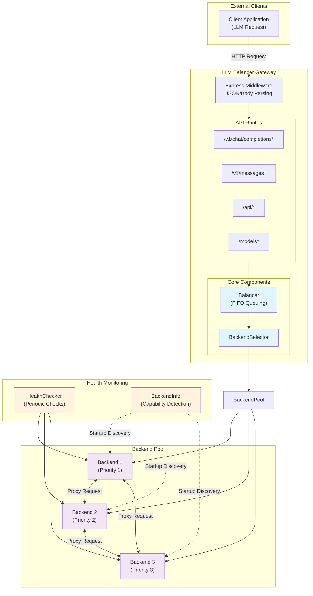
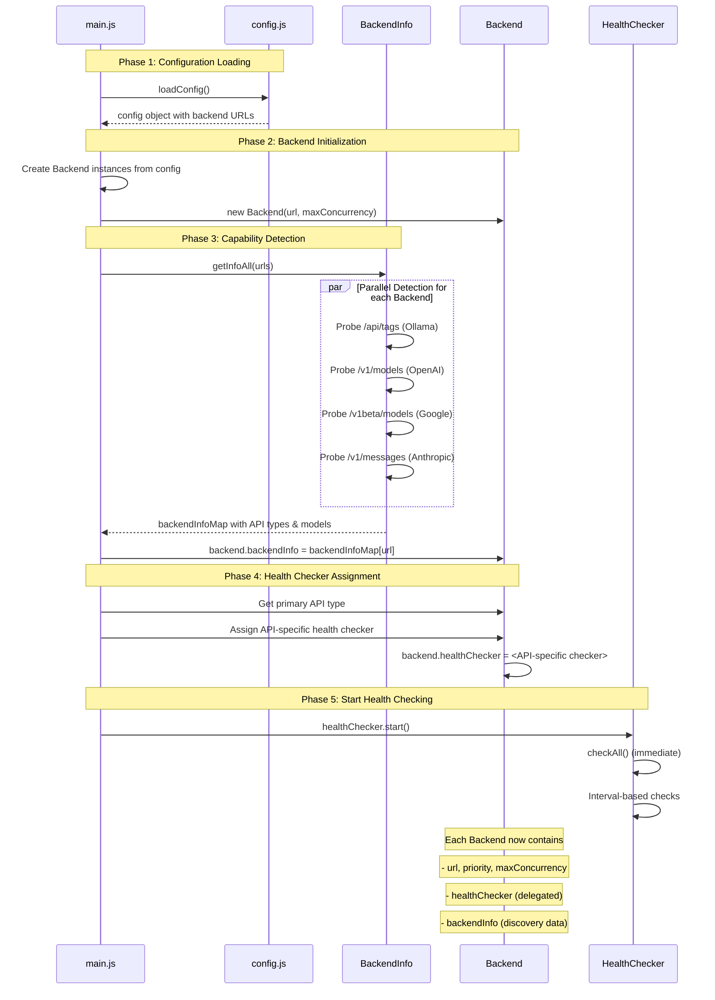
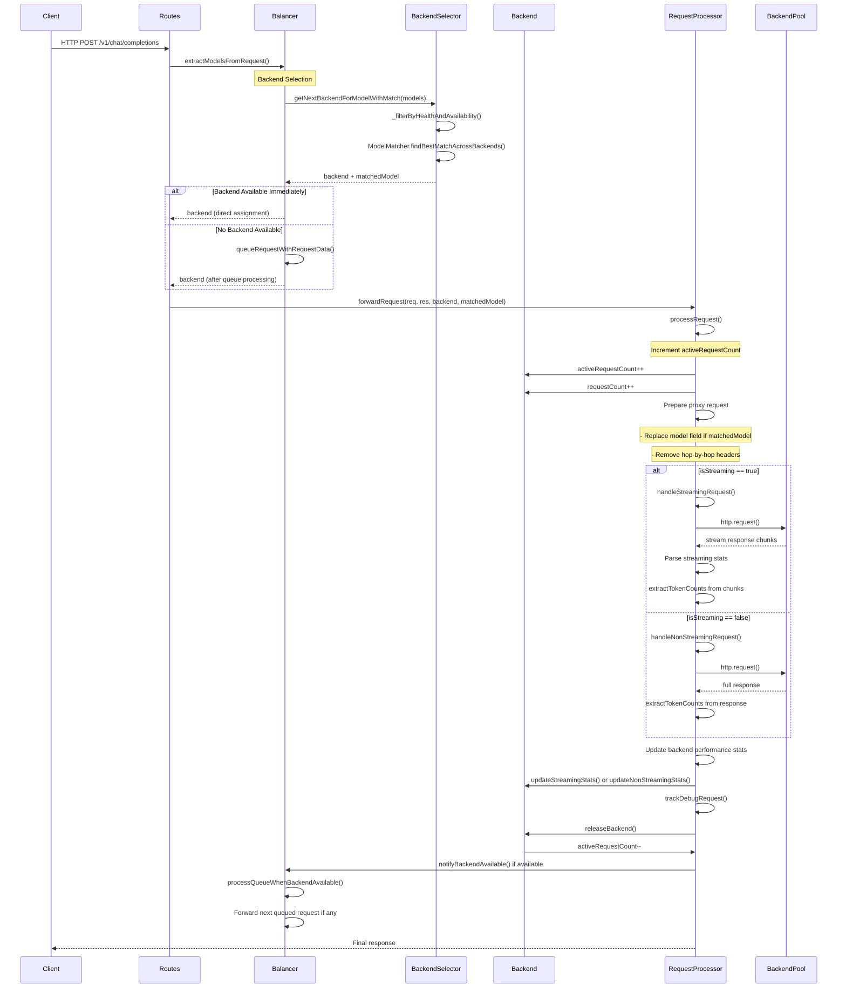
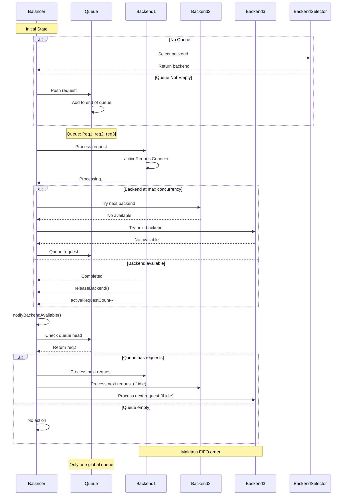
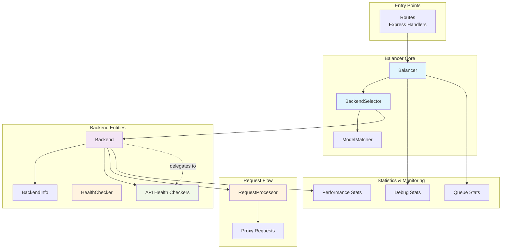
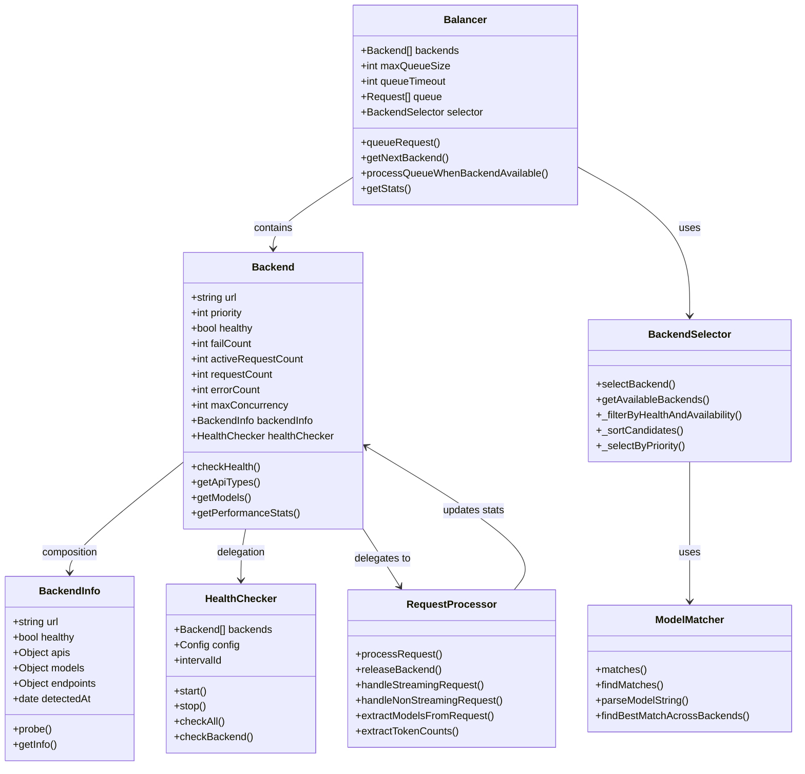
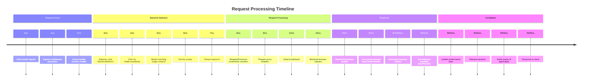

# Data Flow

This document describes the request flow, data processing workflow, and state transitions.

---

## Overview

The LLM Balancer processes requests through several stages:

1. **Request Reception** - API server receives HTTP request
2. **Route Classification** - Determine if request should be queued
3. **Backend Selection** - Select appropriate backend
4. **Request Forwarding** - Forward request to backend
5. **Response Handling** - Return response to client

---

## System Architecture Overview



---

## Startup Phase Flow



---

## Detailed Request Flow

### Request Processing Flow



### Backend Selection Algorithm

The backend selection follows these steps:

1. **Filter by Health and Availability**: Only healthy backends with available concurrency are considered
2. **Model Matching**: If models are specified, use priority-first regex matching to find backends that support the requested models
3. **Sort by Priority**: Among matching backends, sort by priority (descending)
4. **Select Best Candidate**: Return the highest priority available backend

```javascript
// Simplified selection flow
function selectBackend(backends, options = {}) {
  // Step 1: Filter by health and availability
  let candidates = filterByHealthAndAvailability(backends)

  // Step 2: Model matching if needed
  if (options.models) {
    return selectByPriorityFirst(candidates, options.models)
  }

  // Step 3: Sort by priority and select best
  return selectByPriority(candidates)
}
```

---

## Queue Processing Flow



---

## Health Check Flow

```mermaid
flowchart TD
    Start[HealthChecker Start] --> Initialize[Initial checkAll()]

    Initialize --> CheckEach{For Each Backend}

    subgraph HealthCheckCycle["Health Check Cycle"]
        CheckEach --> CheckBackend[Check Backend Health]

        CheckBackend --> CallCheckHealth{backend.checkHealth}
        CallCheckHealth --> Delegate[Delegate to healthChecker.check]

        subgraph APISpecificHealth["API-Specific Health Checkers"]
            Delegate --> CheckType{API Type?}
            CheckType -->|Ollama| OllamaCheck[OllamaHealthCheck<br/>Probe /api/tags]
            CheckType -->|OpenAI/Groq| OpenAICheck[OpenAIHealthCheck<br/>Probe /v1/models]
            CheckType -->|Anthropic| AnthropicCheck[AnthropicHealthCheck<br/>Probe /v1/messages]
            CheckType -->|Google| GoogleCheck[GoogleHealthCheck<br/>Probe /v1beta/models]
        end

        OllamaCheck --> ParseResult{Result?}
        OpenAICheck --> ParseResult
        AnthropicCheck --> ParseResult
        GoogleCheck --> ParseResult

        ParseResult -->|Healthy| MarkHealthy[backend.healthy = true<br/>backend.failCount = 0]
        ParseResult -->|Unhealthy| MarkUnhealthy[backend.healthy = false<br/>backend.failCount++]

        MarkHealthy --> LogHealthy[Log: healthy + models]
        MarkUnhealthy --> LogUnhealthy[Log: unhealthy + error]
    end

    LogHealthy --> CheckNext{More Backends?}
    LogUnhealthy --> CheckNext

    CheckNext -->|Yes| CheckEach
    CheckNext -->|No| NextInterval[Wait: healthCheckInterval]

    NextInterval --> Loop{Interval End?}
    Loop -->|Yes| Start
    Loop -->|No| Loop

    style CheckEach fill:#e8f5e9
    style MarkHealthy fill:#c8e6c9
    style MarkUnhealthy fill:#ffcdd2
    style APISpecificHealth fill:#fff3e0
```

---

## Component Interaction Diagram



---

## Data Model Diagram



---

## Request Lifecycle Timeline



---

## Key Architectural Patterns

**`★ Insight ───────────────────────────────────────────`**

1. **Delegation Pattern**: `Backend.checkHealth()` delegates to `healthChecker.check()` - each backend has an API-specific health checker assigned at startup
2. **Composition over Duplication**: `BackendInfo` (capability detection results) is composed into `Backend` rather than duplicated
3. **Priority-First Model Matching**: When multiple backends match a model pattern, the highest priority healthy backend wins
4. **Single Global Queue**: All queued requests use one FIFO queue, processed when any backend becomes available

`─────────────────────────────────────────────────────`

---

## Related Documentation

- [System Architecture](ARCHITECTURE.md) - High-level architecture
- [Class Hierarchy](CLASSES.md) - Class documentation
- [Testing Guide](TESTING.md) - Testing data flows
- [Debugging Guide](DEBUGGING.md) - Debug features and troubleshooting