# Data Flow

This document describes the request flow, data processing workflow, and state transitions.

---

## Overview

The LLM Balancer processes requests through several stages:

1. **Request Reception** - API server receives HTTP request
2. **Route Classification** - Determine if request should be queued
3. **Backend Selection** - Select appropriate backend
4. **Request Forwarding** - Forward request to backend
5. **Response Handling** - Return response to client

---

## System Architecture Overview

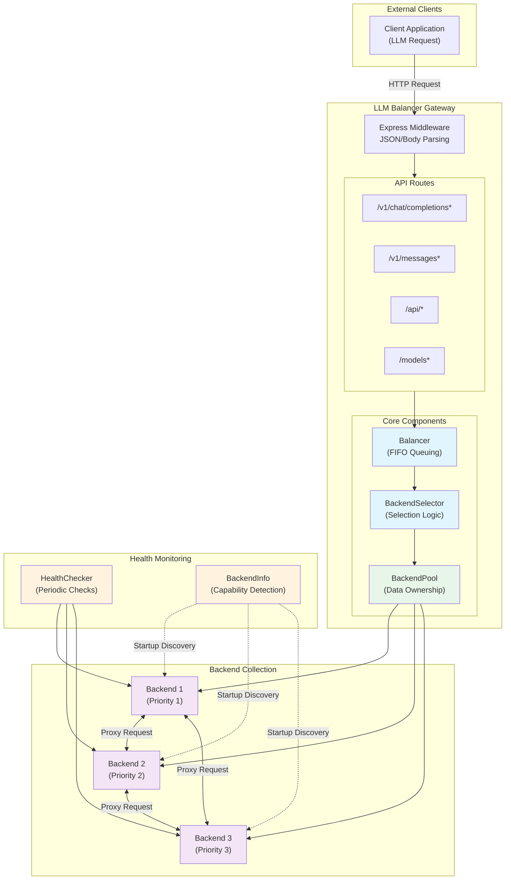

### BackendPool vs BackendSelector Distinction

| Aspect | BackendPool | BackendSelector |
|--------|-------------|-----------------|
| **Responsibility** | Owns the backend collection (source of truth) | Selects the best backend from a list |
| **Returns** | New `BackendPool` instance (filtered collection) | Single `Backend` object (or null) |
| **State** | Stateful (`this._backends`) | Stateless (takes backends as parameter) |
| **Interface** | `filter(criteria)` - unified criteria object | `selectBackend(backends, options)` |
| **Pattern** | Collection pattern (filtered views) | Strategy pattern (selection algorithms) |

**Example Usage:**
```javascript
// BackendPool owns and filters backends
const pool = new BackendPool(backends);
const filteredPool = pool.filter({ healthy: true, models: ['llama3'] });

// BackendSelector picks best backend from filtered list
const candidates = filteredPool.getAll();
const bestBackend = selector.selectBackend(candidates, { models: ['llama3'] });
```

---

## Startup Phase Flow

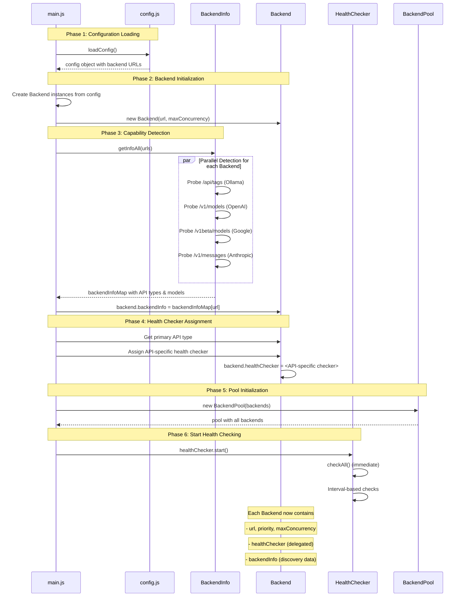

---

## Detailed Request Flow

### Request Processing Flow

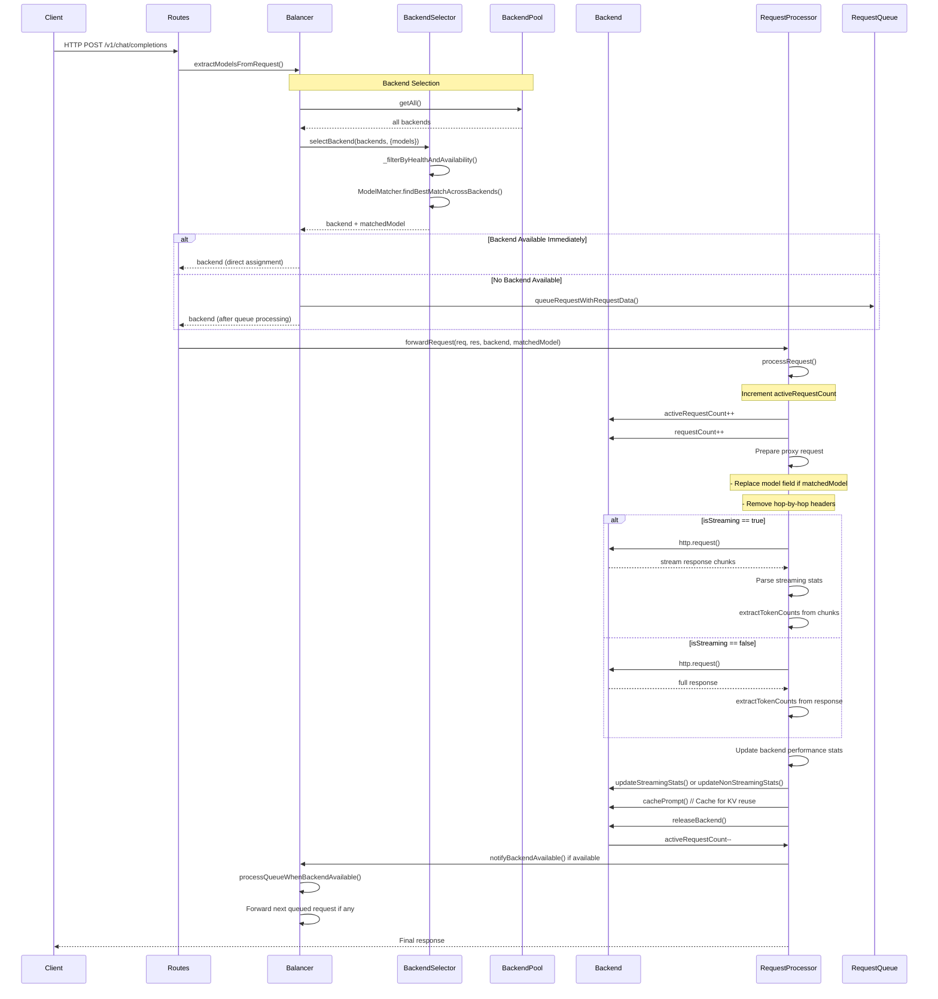

### Queue Processing with Selection Criteria

When requests are queued, each request is assigned a **selection criterion** object that captures what backends can serve it:

```javascript
{
  modelString: 'llama3',     // The matched model
  apiType: 'openai'          // The primary API type
}
```

The criterion is created when the request arrives and stored with the queued request.

When a backend becomes available, `processQueueWhenBackendAvailable()` iterates through the queue:
1. Checks each request's criterion
2. Uses `findBackendForCriterion()` to find a matching backend
3. **Skips requests** where no backend matches the criterion
4. **Processes requests** where a suitable backend exists

This allows requests to be processed out of FIFO order when earlier requests have no suitable backends.

**Example Scenario:**
```
Queue: [Request ModelA, Request ModelB]
Backend1: Has ModelA, busy
Backend2: Has ModelB, available

Result: Request ModelB is processed on Backend2
        Request ModelA remains queued until Backend1 is free
```

---

### Criterion-Based Backend Selection

The `findBackendForCriterion()` method uses BackendPool filtering:

```javascript
// Criterion-based selection flow
function findBackendForCriterion(criterion) {
  // Step 1: Get healthy backends
  let candidates = backendPool.filter({ healthy: true }).getAll()

  // Step 2: Filter by API type if specified
  if (criterion.apiType) {
    candidates = candidates.filter(b => b.supportsApi(criterion.apiType))
  }

  // Step 3: Match models using regex
  if (criterion.modelString) {
    const result = ModelMatcher.findBestMatchAcrossBackends(
      criterion.modelString, candidates
    )
    return result.backend || null
  }

  // Step 4: Fallback to priority selection
  return selectBackend(candidates)
}
```

---

### Prompt Cache-Aware Backend Selection

When processing queued requests, the system uses `selectBackendWithCache()` for intelligent backend selection that considers **prompt cache matches** to enable KV cache reuse. This method returns a structured result with a status (`'found'`, `'busy'`, or `'none'`) to guide queue handling.

```javascript
/**
 * Select backend with prompt cache consideration
 * Returns: { status: 'found'|'busy'|'none', backend, actualModel, message }
 * - 'found': backend available with cache hit or standard selection
 * - 'busy': backend has cache hit but is busy - caller should queue
 * - 'none': no backend supports this model - reject request
 */
function selectBackendWithCache(backends, criterion, promptBody) {
  const modelString = criterion?.modelString

  // === GROUP 1: REJECTION FILTERS (regardless of availability) ===

  // 1.1 Check if any healthy backend supports this model
  const healthyBackends = filterByHealth(backends)
  if (!healthyBackends.length) {
    return { status: 'none', backend: null, message: 'No healthy backends available' }
  }

  const modelMatch = ModelMatcher.findBestMatchAcrossBackends(modelString, healthyBackends)
  if (!modelMatch.matched && modelString) {
    return { status: 'none', backend: null, message: 'No backend supports this model' }
  }

  // === GROUP 2: ACCEPT/QUEUE FILTERS ===

  // 2.1 No cache data - fallback to availability-based selection
  if (!promptBody || !modelString) {
    const availableBackends = filterByHealthAndAvailability(backends)
    if (availableBackends.length === 0) {
      return { status: 'busy', backend: null, message: 'All backends are currently busy' }
    }
    const sorted = sortCandidates(availableBackends)
    return { status: 'found', backend: sorted[0], message: null }
  }

  // 2.2 Check cache on ALL healthy backends (even if busy)
  // Critical: must check all healthy backends to enable proper queuing
  const allCacheMatches = []
  for (const backend of healthyBackends) {
    if (!backend.getApiTypes || !backend.getModels || !backend.findCacheMatch) {
      continue
    }

    const cacheMatch = backend.findCacheMatch(promptBody, modelString, null)
    if (cacheMatch && cacheMatch.similarity >= 0.8) {
      allCacheMatches.push({ backend, similarity: cacheMatch.similarity })
    }
  }

  // 2.3 If cache matches found, prefer cache-hit backends
  if (allCacheMatches.length > 0) {
    // Check if any cache-hit backend is available
    const availableCacheHits = allCacheMatches.filter(
      m => (m.backend.activeRequestCount || 0) < (m.backend.maxConcurrency || 1)
    )

    if (availableCacheHits.length > 0) {
      // Sort by priority, select best available cache-hit backend
      availableCacheHits.sort((a, b) => {
        const priorityB = b.backend.priority || 0
        const priorityA = a.backend.priority || 0
        if (priorityB !== priorityA) return priorityB - priorityA
        return backends.indexOf(a.backend) - backends.indexOf(b.backend)
      })

      const selected = availableCacheHits[0]
      return {
        status: 'found',
        backend: selected.backend,
        message: null
      }
    }

    // All cache-hit backends are busy - return highest priority with 'busy' status
    // Caller (Balancer) should queue for this specific backend
    allCacheMatches.sort((a, b) => {
      const priorityB = b.backend.priority || 0
      const priorityA = a.backend.priority || 0
      if (priorityB !== priorityA) return priorityB - priorityA
      return backends.indexOf(a.backend) - backends.indexOf(b.backend)
    })

    const selected = allCacheMatches[0]
    return {
      status: 'busy',
      backend: selected.backend,
      message: 'Backend with cache hit is busy - queuing for same backend'
    }
  }

  // 2.4 No cache matches - fallback to availability-based selection
  const availableBackends = filterByHealthAndAvailability(backends)

  if (availableBackends.length === 0) {
    return {
      status: 'busy',
      backend: null,
      message: 'All backends supporting this model are currently busy'
    }
  }

  const backend = selectBackendByPriorityFirst(availableBackends, modelString)

  if (backend) {
    return { status: 'found', backend, message: null }
  }

  return {
    status: 'busy',
    backend: null,
    message: 'All backends supporting this model are currently busy'
  }
}
```

**★ Insight ───────────────────────────────────────────**

1. **Rejection vs Accept Filters**: The function separates concerns into two groups - rejection filters (model support) that immediately return `'none'` regardless of availability, and accept/queue filters that distinguish between `'found'` and `'busy'` statuses
2. **Cache Check on All Healthy Backends**: Critical fix - cache is checked on all healthy backends even if busy, enabling proper queuing to the same backend for KV cache reuse
3. **Three-Status Return Pattern**: `'found'` means request can proceed, `'busy'` means queue for this backend, `'none'` means reject - this enables the Balancer to make intelligent queuing decisions

**─────────────────────────────────────────────────────**

**Selection Flow Priority:**

1. **Model Support Validation** → If no healthy backend supports the model → `'none'` (reject)
2. **No Cache Data Fallback** → If no `promptBody` → priority selection among available → `'found'` or `'busy'`
3. **Cache Match Check** → Check all healthy backends (even if busy)
   - Available cache hit found → `'found'` with selected backend
   - Only busy cache hits → `'busy'` with backend for queuing
4. **No Cache Match Fallback** → Standard model-based selection with availability check → `'found'` or `'busy'`

**Example Scenarios:**

**Scenario A: Available Cache Hit**
```
Queue: [Request with prompt "Write a story about..."]
Backend1: Priority=10, has cached prompt (similarity=95%), available
Backend2: Priority=20, no cache match, available

Result: Backend1 selected (status='found')
Cache hit prioritized over higher priority backend for KV reuse benefit
```

**Scenario B: Only Busy Cache Hit**
```
Queue: [Request with prompt "Write a story about..."]
Backend1: Priority=10, has cached prompt (similarity=95%), busy (activeRequestCount=maxConcurrency)
Backend2: Priority=20, no cache match, available

Result: Backend1 selected (status='busy', backend=Backend1)
Balancer queues request specifically for Backend1 when it becomes available
Same backend = KV cache reuse for similar prompts
```

**Scenario C: No Cache Matches**
```
Queue: [Request with prompt "New topic..."]
Backend1: Priority=10, no cache match, available
Backend2: Priority=20, no cache match, available

Result: Backend2 selected (status='found')
Falls back to priority-based selection among available backends
```

**Scenario D: No Backend Supports Model**
```
Queue: [Request for model "nonexistent-model"]
Backend1: Priority=10, models: ['llama3', 'qwen']
Backend2: Priority=20, models: ['llama3', 'qwen']

Result: (status='none', backend=null)
Request rejected immediately - no need to queue
```

**Why This Matters:**

| Status | Meaning | Balancer Action |
|--------|---------|-----------------|
| `'found'` | Backend available | Forward request immediately |
| `'busy'` | Backend exists but busy | Queue request (may be for specific backend) |
| `'none'` | No backend supports model | Reject request immediately |

- **Why check all healthy backends (even busy)?** Without checking busy backends, we'd miss cache hits and queue for a random available backend instead of the one with cached prompts
- **Three-status pattern enables smarter queuing**: Distinguishes between "queue for a backend" vs "reject because model not supported"
- **KV cache reuse**: When the same backend can be queued for, subsequent similar prompts reuse cached KV cache, significantly reducing generation time

**★ Insight ───────────────────────────────────────────**

**Why Re-Selection at Queue Dequeue Time is Intentional**

The `selectBackendWithCache` function may return a specific backend with `status='busy'`, but **this backend is NOT fixed** for the request. When the request is later dequeued, the entire selection flow is run again. This is critical because:

1. **Cache exists on multiple backends**: The same prompt fingerprint may be cached on several backends simultaneously
2. **Best cache-hit may change**: A backend that was busy at enqueue time may be available at dequeue time
3. **Dynamic optimization**: Re-running selection ensures we always pick the best available cache-hit at the moment of execution

**Example Scenario:**
```
Time T1 (Enqueue):
- Request for prompt "Write a story about..." arrives
- Backend1: has cache (similarity=95%), busy
- Backend2: has cache (similarity=90%), busy
- Backend3: no cache, available

Result: Backend1 selected (status='busy') - highest priority cache hit

Time T2 (Dequeue):
- Backend1: still busy
- Backend2: now available (prior request completed)
- Backend3: still available

Re-run selection:
- Cache check on ALL healthy backends
- Backend2 found with cache hit, now available
- Backend2 selected (status='found') - best available cache hit
```

**Critical Note: Selection Always Checks All Cache-Hits**

The current implementation **ALREADY** handles this correctly! When multiple backends have cache hits:

```javascript
// Line 299-318: Check if ANY cache-hit backend is available
const availableCacheHits = allCacheMatches.filter(
  m => (m.backend.activeRequestCount || 0) < (m.backend.maxConcurrency || 1)
);

if (availableCacheHits.length > 0) {
  // Sort available cache-hits by priority and select best
  availableCacheHits.sort((a, b) => priorityB - priorityA);
  return { status: 'found', backend: availableCacheHits[0].backend };
}
```

This means: if Backend1 (priority 10) has a cache hit but is busy, and Backend2 (priority 20) also has a cache hit and is available, **Backend2 is selected immediately** with `status='found'`.

The `status='busy'` path (lines 320-335) is ONLY reached when **ALL** cache-hit backends are busy, meaning there is literally no available backend with a cache hit at that moment.

**──────────────────────────────────────────────���──────**

**★ Insight ───────────────────────────────────────────**

The key architectural insight is the **two-group filter separation**: rejection filters (Group 1) provide immediate determinism for unsupported models, while accept/queue filters (Group 2) handle the complexity of availability and caching with nuanced `'found'` vs `'busy'` responses that enable the Balancer to make intelligent queuing decisions.

**─────────────────────────────────────────────────────**

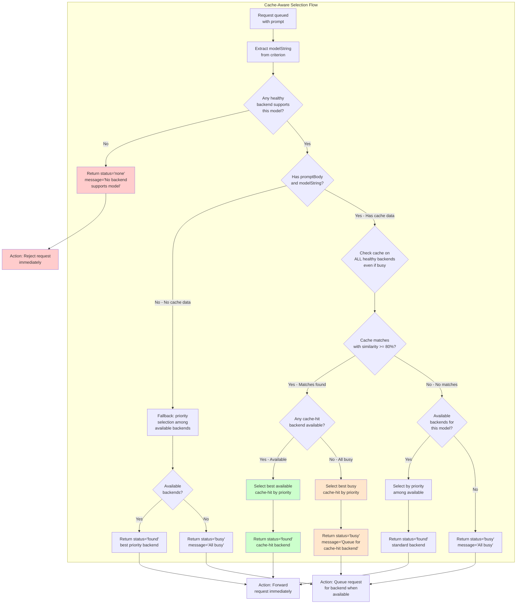

---

### Backend Selection Algorithm

The backend selection follows these steps:

1. **Filter by Health and Availability**: Only healthy backends with available concurrency are considered
2. **Model Matching**: If models are specified, use priority-first regex matching to find backends that support the requested models
3. **Sort by Priority**: Among matching backends, sort by priority (descending)
4. **Select Best Candidate**: Return the highest priority available backend

```javascript
// Simplified selection flow
function selectBackend(backends, options = {}) {
  // Step 1: Filter by health and availability
  let candidates = filterByHealthAndAvailability(backends)

  // Step 2: Model matching if needed
  if (options.models) {
    return selectByPriorityFirst(candidates, options.models)
  }

  // Step 3: Sort by priority and select best
  return selectByPriority(candidates)
}
```

---

### BackendPool Filter Interface

BackendPool provides a unified filter interface:

```javascript
// Filter criteria object
{
  healthy: boolean,           // true = only healthy, false = only unhealthy
  available: boolean,         // true = has capacity, false = at max
  models: string[],           // Filter backends supporting these models
  custom: function(backend)   // Custom filter function
}

// Usage examples
const healthyPool = pool.filter({ healthy: true });
const availablePool = pool.filter({ available: true });
const modelPool = pool.filter({ models: ['llama3', 'qwen'] });
const combinedPool = pool.filter({ healthy: true, available: true });

// Chaining (immutable pattern)
const result = pool
  .filter({ healthy: true })
  .filter({ available: true })
  .filter({ models: ['llama3'] });
```

---

## Queue Processing Flow

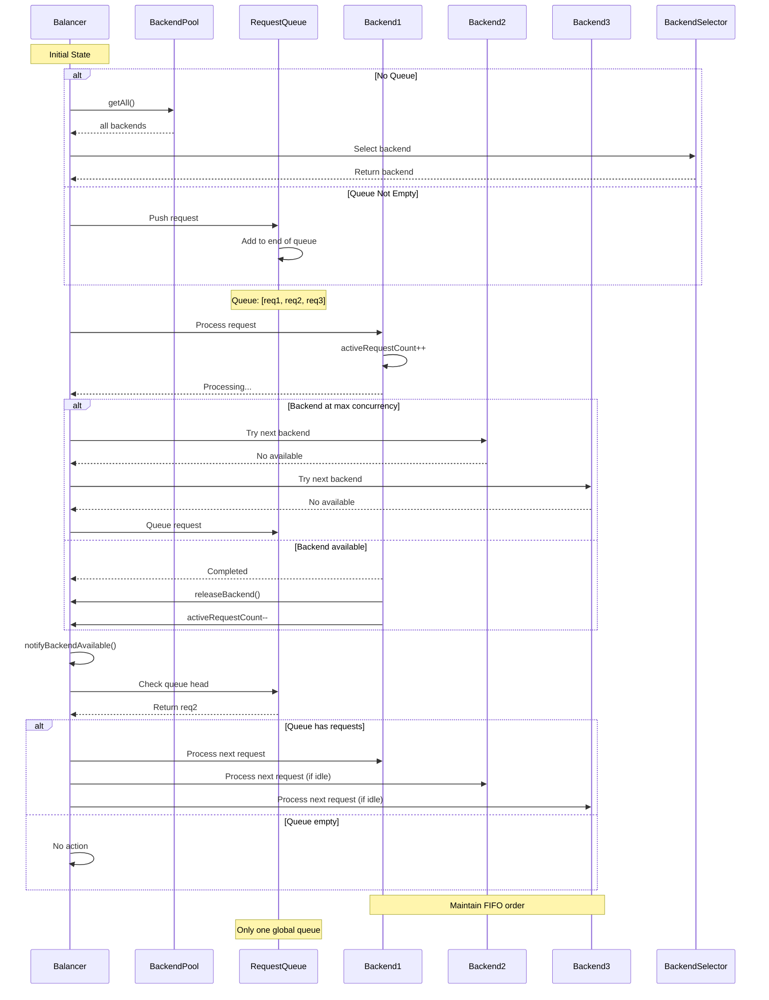

---

## Health Check Flow

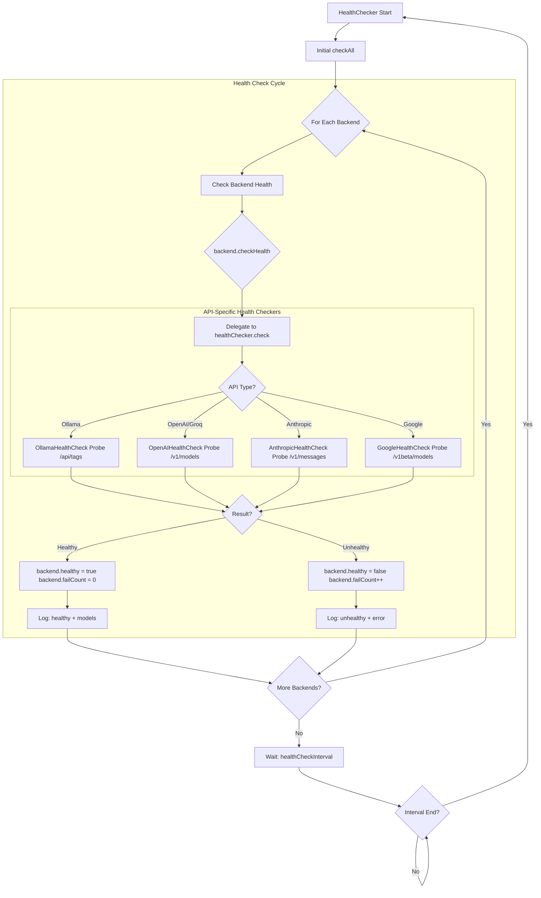

---

## Component Interaction Diagram

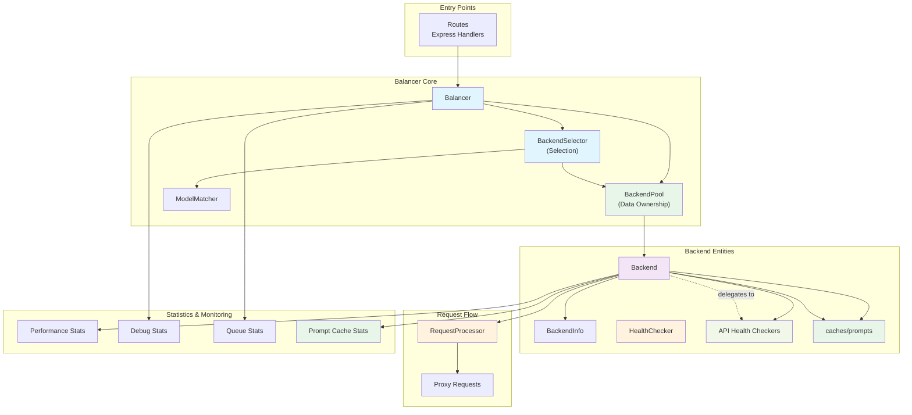

---

## Data Model Diagram

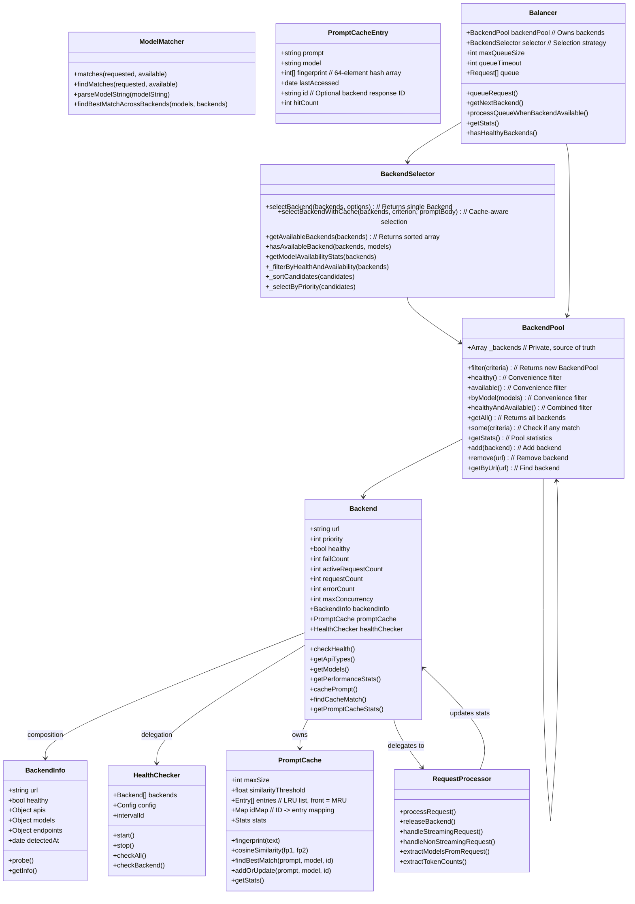

---

## Request Lifecycle Timeline

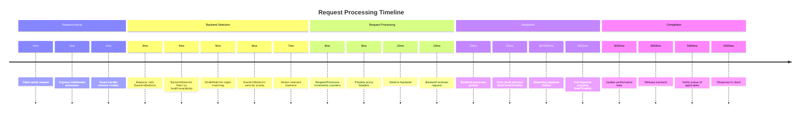

---

## Key Architectural Patterns

**`★ Insight ───────────────────────────────────────────`**

1. **Delegation Pattern**: `Backend.checkHealth()` delegates to `healthChecker.check()` - each backend has an API-specific health checker assigned at startup
2. **Composition over Duplication**: `BackendInfo` (capability detection results) is composed into `Backend` rather than duplicated
3. **Priority-First Model Matching**: When multiple backends match a model pattern, the highest priority healthy backend wins
4. **Single Global Queue**: All queued requests use one FIFO queue, processed when any backend becomes available
5. **Collection Pattern**: `BackendPool` owns data and provides filtered views
6. **Strategy Pattern**: `BackendSelector` encapsulates selection algorithms independently of data ownership

**─────────────────────────────────────────────────────**

---

## Prompt Cache System

### Overview

The prompt cache enables KV cache reuse by storing prompts per backend. When similar prompts are detected, backends can reuse cached KV cache, significantly reducing generation time.

### Architecture

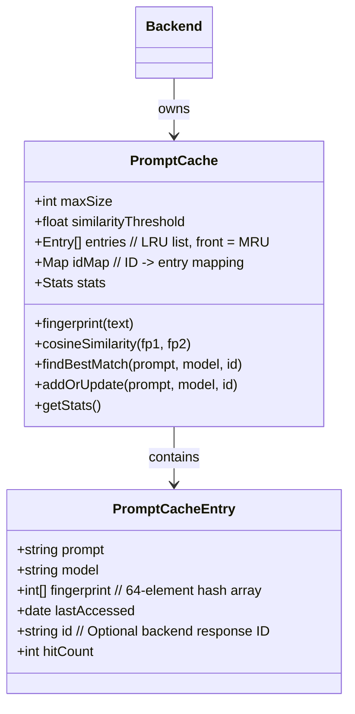

### Cache Strategy

1. **Fingerprint Computation**: Token-level FNV-1a 64-bit hash of prompt+model composite key
2. **Similarity Matching**: Cosine similarity on fingerprint arrays (threshold: 0.85)
3. **LRU Eviction**: Most recently used entries stay in cache, oldest evicted first
4. **Model Isolation**: Each model has separate cache entries (composite key: prompt+model)

### Priority Lookup

1. **ID-based**: If backend provides response ID, use instant O(1) lookup
2. **Fingerprint-based**: Compute cosine similarity on fingerprints (O(64))

### Cache Statistics

```json
{
  "hits": 0,
  "misses": 0,
  "evictions": 0,
  "idMatches": 0,
  "similarityMatches": 0,
  "size": 5,
  "maxSize": 5,
  "cachedPrompts": [
    {
      "model": "qwen/qwen3.5-35b-a3b",
      "prompt": "{...}",
      "lastAccessed": 1773455665362,
      "hitCount": 0
    }
  ]
}
```

### Request Flow with Cache

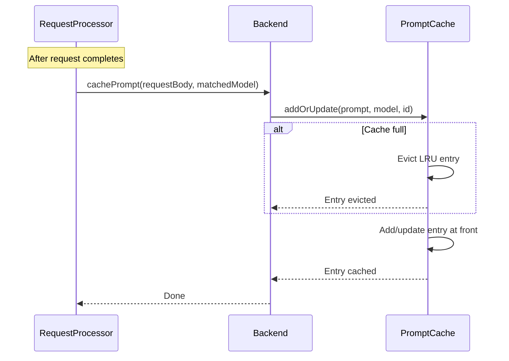

---

### Sequential vs Concurrent Request Behavior

The timing of requests significantly impacts cache hit behavior:

#### Sequential Requests (Wait for first to complete)

```
Time →
Request 1: ━━━━━━━━━━━━▶ Completed
                    Request 2: ━━━━━━━━━━━━▶ Completed

Cache State:
- Request 1: Miss → Prompt stored
- Request 2: Guaranteed Hit → Same backend selected
```

**Behavior:**
- First request completes → prompt fingerprint stored in cache
- Second request sees populated cache → **guaranteed cache hit**
- **Same backend** serves both requests (deterministic)
- `hits: 1, misses: 1`

#### Concurrent Requests (Both arrive before first completes)

```
Time →
Request 1: ━━━━━━━━━━━━▶ Completed
Request 2: ━━━━━━━━━━━━▶ Completed

Cache State:
- Both requests may see empty cache
- Each may be assigned to different backend
- First request's cache populated after dequeue
```

**Behavior:**
- Both requests queued before either completes
- Cache lookup happens at dequeue time (cache may be empty)
- **Different backends** may serve each request
- `hits: 0, misses: 2` (if both miss)

#### Key Insight

**Sequential requests guarantee cache reuse:**

| Scenario | Cache Hit | Same Backend |
|----------|-----------|--------------|
| Sequential (wait) | Guaranteed | Yes |
| Concurrent (no wait) | Not guaranteed | Not guaranteed |

This is critical for KV cache benefits:

- **Sequential**: Second request benefits from first request's cached KV cache
- **Concurrent**: Neither request may benefit from cache reuse

**Configuration Impact:**
```javascript
// High queueTimeout with many concurrent requests → more cache misses
// Low queueTimeout with sequential requests → more cache hits
```

## Related Documentation

- [System Architecture](ARCHITECTURE.md#system-architecture) - High-level architecture
- [Class Hierarchy](CLASSES.md#class-hierarchy) - Class documentation
- [Testing Guide](TESTING.md#testing-guide) - Testing data flows
- [Debugging Guide](DEBUGGING.md#debug-features) - Debug features and troubleshooting